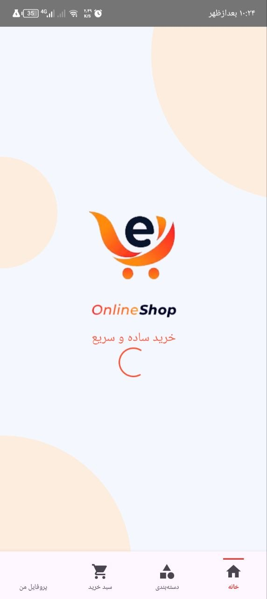
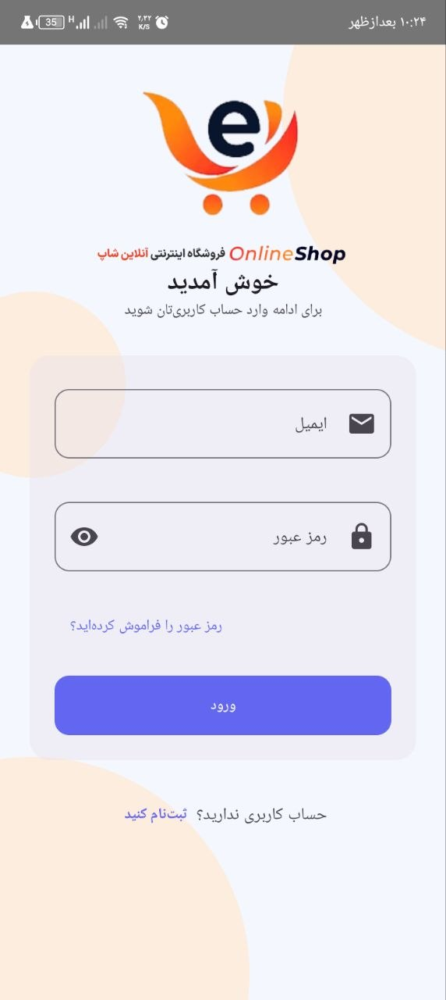
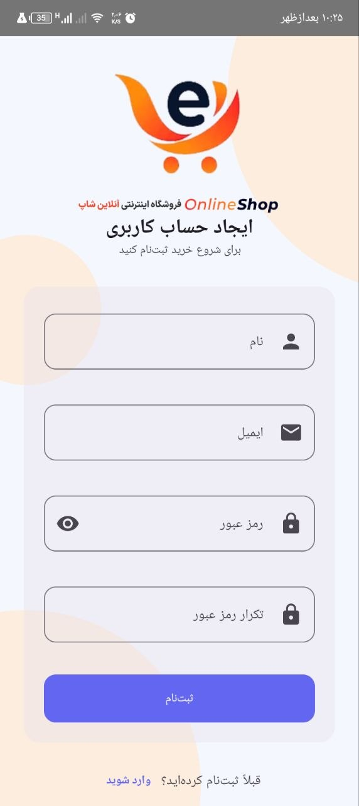
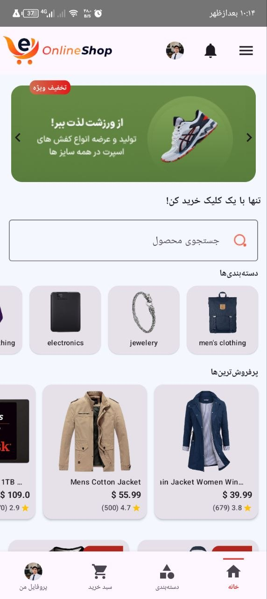
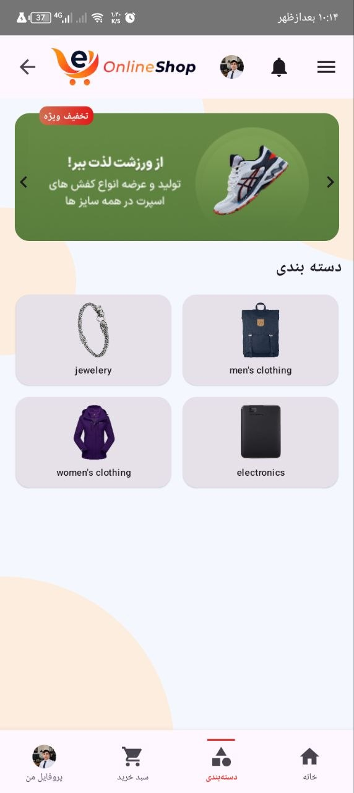
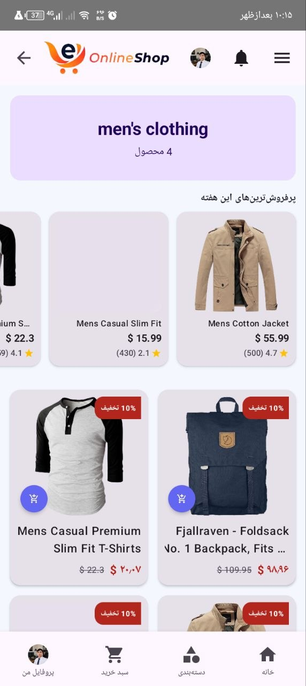
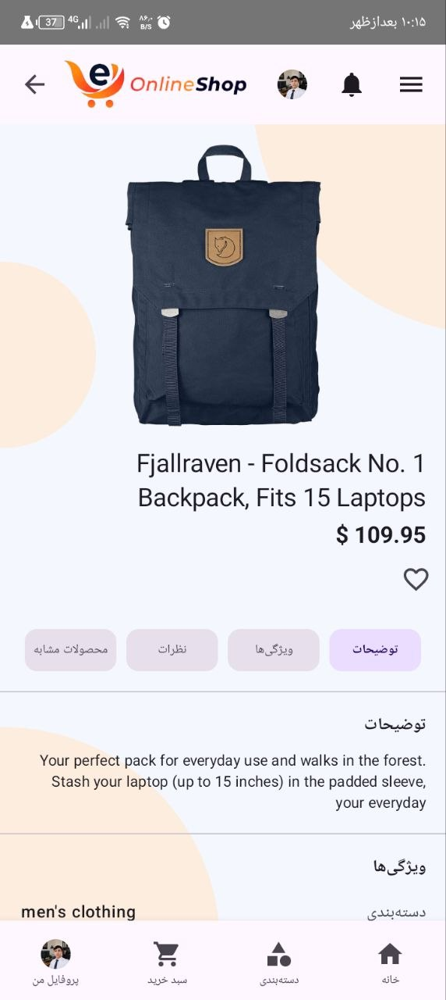

## Screenshots

  
  
  

  
  
  

  
  
    

# 🛍️ ShopEase

A modern Android shopping application built with Kotlin and Jetpack Compose.

## 📱 About

ShopEase is a modern e-commerce Android application designed to provide a smooth and user-friendly shopping experience.

## ✨ Features

- 🔐 User Authentication
- 🏠 Modern Home Screen
- 🛍️ Product Browsing
- 🔎 Product Search
- ❤️ Favorites / Wishlist
- 🛒 Shopping Cart
- 📍 Address Management
- 💳 Checkout
- 📦 Order Management
- 👤 User Profile
- 🔔 Notifications
- ⚙️ Settings

## 🛠️ Tech Stack

- Kotlin
- Jetpack Compose
- Material 3
- MVVM
- Clean Architecture
- Hilt
- Coroutines
- Room Database
- Ktor
- Navigation Compose

## 🏗️ Architecture

The project follows a clean and scalable architecture with separation between:

- Presentation
- Domain
- Data
- Core

## 🚀 Getting Started

1. Clone the repository.
2. Open the project in Android Studio.
3. Wait for Gradle Sync to complete.
4. Run the application on an Android device or emulator.

## 📌 Project Status

🚧 This project is currently under development.

## 👨‍💻 Developer

Alinasir Mirzaie

Android Developer | Kotlin | Jetpack Compose
